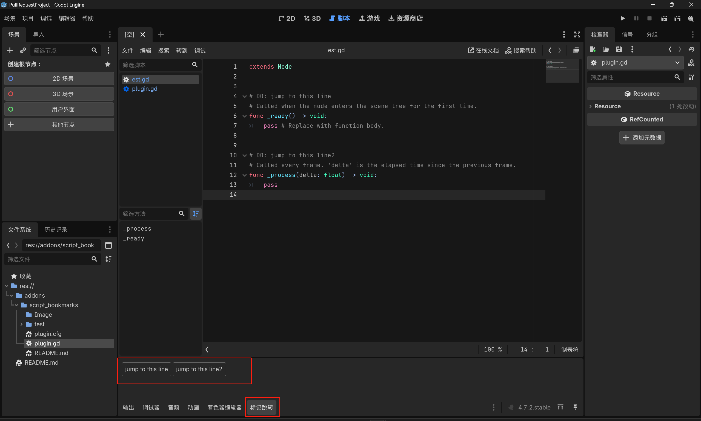
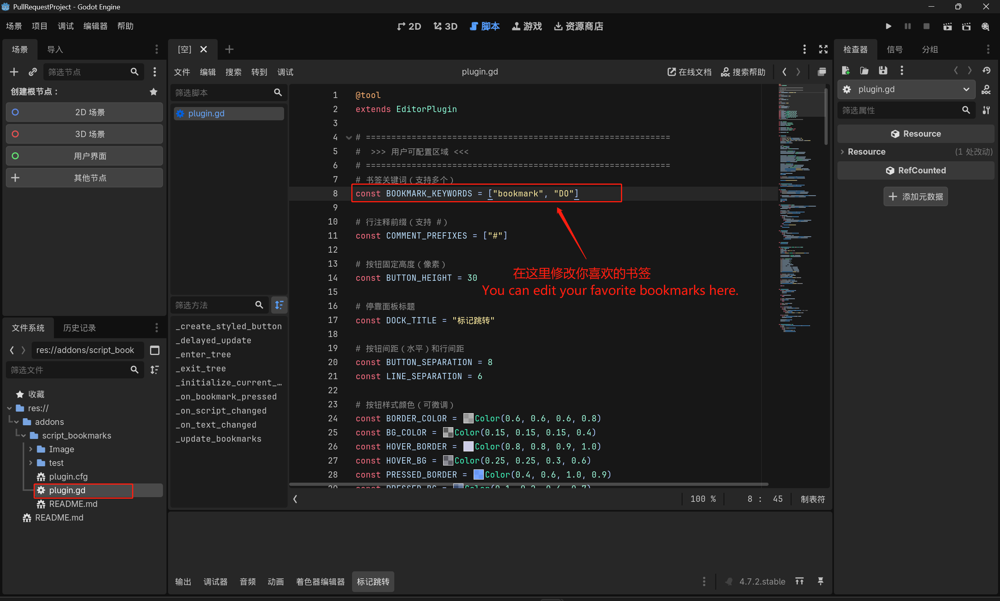

# Godot Script Editor Bookmarks

## [ZH] Godot脚本编辑器书签插件

- 可将插件的`plugin.gd`脚本中，将数组`BOOKMARK_KEYWORDS`中的值修改为你喜欢的书签
- 启用插件后，可以使用 `#` + `你的标签`+ `:`进行标记，例如： `# DO: 跳转到这里`
- 自定义标签必须独占一行才能正常运行

## [EN] Godot Script Editor Bookmarks Plugin

- In the plugin's plugin.gd script, you can change the values in the BOOKMARK_KEYWORDS array to your preferred bookmarks.
- After enabling the plugin, you can mark with `#` + `your tag` + `:`, for example: `# DO: Jump here`.
- Custom tags must be on a separate line to work properly.

